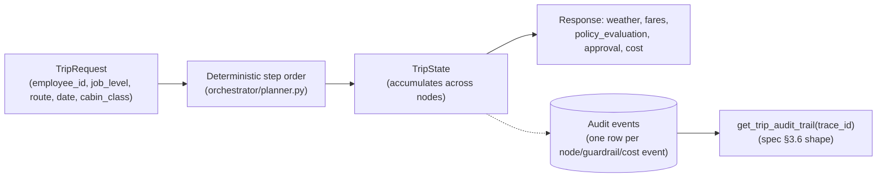

# High-Level Design (HLD)

See [`architecture.md`](architecture.md) for the component diagram and
request sequence this document assumes.

## 1. Goals

- Plan a business trip end to end (weather, live-ish flight pricing, policy
  compliance) through a multi-agent ReAct system, not a single monolithic
  prompt.
- Make every out-of-policy fare visible and gated behind human approval
  before the one mutating action (`book_flight`) can run.
- Produce, by construction, an expense-audit record and a FinOps record
  (agent compute cost vs. business fare cost) — not as an afterthought
  reporting layer, but as the natural output of the request path.
- Survive a provider outage (flight pricing) or quota exhaustion without
  hanging or crashing.

Full functional/non-functional requirements: the build spec, §3–4.

## 2. Design principles

1. **Allow-list every agent's tools at construction**, not just by
   prompting. `agents/base.py` raises if an agent is built with a tool
   outside its declared set; `guardrails/allowlist.py` re-checks at
   invocation time as defense in depth.
2. **One `trace_id` per request**, threaded through every agent call, tool
   call, cache hit/miss, guardrail event, and audit record. It is the only
   join key needed to reconstruct a request end to end (spec §8).
3. **Deterministic rulings, LLM explanations.** Whether a fare is in policy
   is computed by `guardrails/thresholds.py` from `config/guardrails.yaml`
   — never by asking the model. The Policy Agent's LLM call produces a
   *citable explanation* of that ruling, and the explanation itself is
   checked for groundedness (does it actually cite a clause the retriever
   returned) before being trusted.
4. **Provider-swappable at the boundary, not scattered through the
   codebase.** Flight pricing (Duffel/Aviationstack), the vector DB
   (originally spec'd as Pinecone, built on Qdrant), and the LLM/embeddings
   provider (originally spec'd as Anthropic, built on OpenAI) are each
   swappable by changing one module (`tools/flight_tools.py`,
   `rag/retriever.py`, `agents/base.py`) plus config/env — not by hunting
   through call sites.
5. **Graceful degradation over hard failure.** A flight-provider outage
   returns a structured `available: False` result, never an exception that
   propagates up and kills the orchestrator run.
6. **Guardrail policy is config, not code.** Spend caps, approval routing,
   and cabin-class eligibility live in `config/guardrails.yaml` so
   travel/finance ops can change them without a deploy.

## 3. Logical architecture

Five layers, each independently testable:

1. **Interface** — Streamlit (human) and FastAPI (programmatic/UI backend).
2. **Orchestration** — LangGraph `StateGraph`: `weather → flight_search →
   policy_check`, with a conditional edge back to `flight_search` for the
   reflection loop, bounded by `max_reflection_retries`.
3. **Agents** — Weather, Flight, Policy: tool-scoped ReAct agents built on
   a shared base that centralizes tool allow-listing and cost recording.
4. **Tool boundary** — MCP for anything that reaches an external
   read-mostly API (weather, flight search) or the one write action
   (booking); a plain LangChain tool for policy retrieval (not spec'd as
   MCP-scoped, and job-level-sensitive enough to want the tool's schema to
   physically exclude `job_level` as an LLM-fillable parameter).
5. **Cross-cutting** — guardrails, cache, cost ledger, audit store,
   observability. None of these live inside an agent; they wrap the
   orchestrator's nodes.

## 4. Data flow

`TripState` (see `orchestrator/state.py`) is the single object threaded
through every LangGraph node — each node returns a partial update, LangGraph
merges it. The audit store is a parallel, append-only log of the same
journey, aggregated on demand rather than mutated in place, so it can never
be edited after the fact.

## 5. Non-functional design decisions

| Concern | Decision | Why |
|---|---|---|
| Reliability (flight API) | Provider-swappable + graceful degradation + route cache | Aviationstack's free quota is tiny; Duffel test mode absorbs dev iteration |
| Scalability | Stateless FastAPI process; approvals and the cost ledger are process-local in-memory dicts; the route cache is Redis-backed (real, not just designed-for) when `REDIS_URL` is set, in-process otherwise | The route cache already scales across instances; approvals/ledger are the remaining process-local state — the *interface* (`approval_gate.py`) doesn't change if that moves too, only what's behind it |
| Multi-tenancy | Job-level scoping today; business-unit scoping would extend `guardrails.yaml` + the Qdrant metadata filter the same way | Matches spec's job-level requirement exactly; same pattern generalizes |
| Environment separation | `.env` per environment, `AUDIT_DB_URL`/`FLIGHT_PROVIDER` as the two env-driven swaps that matter most | SQLite/Duffel-test locally, Postgres/Aviationstack-live in a demo/prod pass |
| Auth | Mock persona header today, same interface shape (`resolve_identity` -> `EmployeeIdentity`) a real OIDC client would have | Real IdP/SSO explicitly out of scope for the live build per the spec's sequencing guidance |
| Testing | Every guardrail, cache, ledger, and store module is unit-tested offline (fakes/mocks, no live keys); only full agent execution needs live LLM/API keys | Keeps `pytest` fast and running in CI without secrets |

## 6. What would change for a production deployment

- `audit/store.py`: point `AUDIT_DB_URL` at Postgres — no code change.
- `cache/route_cache.py`: already done — set `REDIS_URL` and it's Redis-backed,
  no code change; unset, it falls back to an in-process cache.
- `guardrails/approval_gate.py` and `cost/ledger.py`: currently in-memory
  dicts mirrored to the audit store; a production build would read state
  back from the audit store directly instead of trusting process memory,
  so a restart doesn't lose in-flight approvals.
- `api/auth.py`: real OIDC/OAuth2 client behind the same `resolve_identity`
  contract.
- `observability/tracing.py`: the Langfuse call shapes are marked
  unverified against the pinned SDK version — confirm against a real
  Langfuse account before trusting the tracing data.
