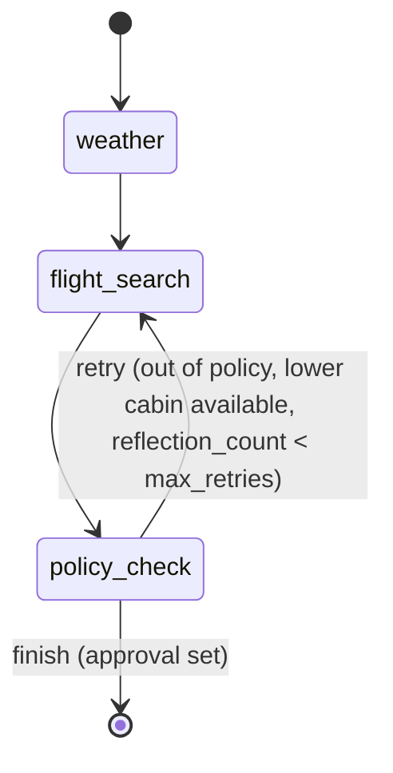

# Low-Level Design (LLD)

Module-by-module detail, data contracts, and the exact state-machine
definition. See [`architecture.md`](architecture.md) for diagrams and
[`HLD.md`](HLD.md) for design rationale.

## 1. Orchestrator state machine

**File**: `src/trip_planner/orchestrator/graph.py`



Routing function `route_after_policy_check(state)` returns `"retry"` if the
node's update did **not** set `approval`, `"finish"` otherwise — this is
the entire reflection-loop contract; no separate counter node is needed
because `policy_check_node` itself increments `reflection_count` on the
state before looping back.

### `TripState` (orchestrator/state.py)

```python
class TripRequest(TypedDict):
    employee_id: str
    job_level: str                # "ic" | "manager" | "director"
    destination_city: str
    origin_airport: str           # IATA
    destination_airport: str      # IATA
    departure_date: str           # ISO date
    cabin_class: NotRequired[str]         # default "economy"
    is_international: NotRequired[bool]   # default False

class TripState(TypedDict):
    trace_id: str
    request: TripRequest
    geocode: NotRequired[dict]
    weather: NotRequired[dict]
    flight_search: NotRequired[dict]      # FlightSearchResult
    policy_evaluation: NotRequired[dict]  # PolicyEvaluation
    approval: NotRequired[dict]           # ApprovalRecord
    reflection_count: NotRequired[int]
    cost: NotRequired[dict]               # Ledger snapshot, attached at completion
    status: NotRequired[str]              # "ok" | "degraded" | "error"
    errors: NotRequired[list[str]]
```

## 2. Data contracts

### `Fare` (tools/flight_tools.py)
```python
class Fare(TypedDict):
    carrier: str
    price_usd: float
    price_is_estimated: bool   # True for Aviationstack (no native fare-pricing data)
    cabin_class: str
    fare_rules: str
    provider: str
```

### `ThresholdEvaluation` (guardrails/thresholds.py)
```python
class ThresholdEvaluation(TypedDict):
    within_policy: bool
    requires_approval: bool
    cap_usd: float
    approver_role: str
    cabin_class_allowed: bool
    max_cabin_class: str
```

### `PolicyEvaluation` (agents/policy_agent.py)
```python
class PolicyEvaluation(TypedDict):
    fare: dict
    threshold: ThresholdEvaluation
    retrieved_clauses: list[Clause]
    explanation: str            # LLM's grounded (or flagged ungrounded) explanation
    grounded: bool
    cited_section_ids: list[str]
```

### `ApprovalRecord` (guardrails/approval_gate.py)
```python
ApprovalStatus = Literal["auto_approved", "pending", "approved", "rejected"]

class ApprovalRecord(TypedDict):
    trace_id: str
    status: ApprovalStatus
    approver_role: str
    approved_by: str | None
    fare: dict
    job_level: str
```

### `AuditEvent` (audit/store.py, SQLAlchemy model)
| Column | Type | Notes |
|---|---|---|
| `id` | Integer PK, autoincrement | |
| `trace_id` | String(64), indexed | join key across everything |
| `event_type` | String(64), indexed | e.g. `weather_node_complete`, `approval_required`, `llm_call_cost` |
| `timestamp` | DateTime(timezone=True) | UTC |
| `payload` | JSON | redacted (`audit/redact.py`) before write |

`get_trip_audit_trail(trace_id)` aggregates all rows for one `trace_id`
into: `candidate_fares`, `policy_clauses_applied`, `approval_outcome`,
`final_fare`, `agent_cost_usd`, `business_cost_usd`, `call_sequence`.

## 3. Config file schemas

### `config/guardrails.yaml`
```yaml
job_levels:
  <job_level>:                       # ic | manager | director
    label: str
    max_cabin_class: str
    domestic_spend_cap_usd: float
    international_spend_cap_usd: float
    preapproval_threshold_usd: float
    approver_role: str
    advance_booking_days_required: int
preferred_carriers: list[str]
max_reflection_retries: int
prompt_injection_check_enabled: bool
groundedness_check_enabled: bool
groundedness_min_citations: int
```

### `config/flight_provider.yaml`
```yaml
active: duffel | aviationstack     # overridable by FLIGHT_PROVIDER env var
providers:
  duffel: {base_url, mode, timeout_seconds, api_version}
  aviationstack: {base_url, mode, timeout_seconds, free_quota_requests, quota_warning_threshold}
on_failure: return_unavailable_observation
```

### `config/model_prices.yaml`
```yaml
default_model: str          # e.g. gpt-4.1
orchestrator_model: str
models:
  <model_id>: {input_per_1m_usd, output_per_1m_usd, cache_write_per_1m_usd, cache_read_per_1m_usd}
embeddings:
  <model_id>: {input_per_1m_usd}
```

## 4. API contract

| Method | Path | Request body | Response | Notes |
|---|---|---|---|---|
| GET | `/health` | — | `{"status": "ok"}` | |
| POST | `/trip-requests` | `TripRequestIn` (city, IATA×2, date, cabin_class, is_international) | `TripState` (JSON) | Requires `X-Employee-Id` header |
| POST | `/approvals/{trace_id}/grant` | `{"approved_by": str}` | `ApprovalRecord` | 404 if no pending record |
| POST | `/approvals/{trace_id}/reject` | `{"approved_by": str}` | `ApprovalRecord` | |
| POST | `/trip-requests/{trace_id}/book` | — | `BookingResult` | Blocked without a granted approval record |
| POST | `/policy-questions` | `{"query": str}` | `PolicyQuestionAnswer` | Semantic-cached, job-level-scoped |
| GET | `/audit/{trace_id}` | — | audit trail dict (§2 above) | The runbook endpoint |

All routes except `/health` go through `guardrails/prompt_injection.py`
(on `/trip-requests`, via `run_trip_planning`) and rate limiting
(`slowapi`, 60/min default).

## 5. Cost calculation

**File**: `src/trip_planner/cost/ledger.py`

```
uncached_input_tokens = max(0, input_tokens - cache_read_tokens)
cost_usd = (
    uncached_input_tokens * input_per_1m_usd
  + cache_read_tokens    * cache_read_per_1m_usd
  + output_tokens        * output_per_1m_usd
) / 1_000_000
```

Recorded centrally in `AllowListedReActAgent.ainvoke(trace_id=...)`
(`agents/base.py`) by summing `usage_metadata` across every `AIMessage` in
the ReAct trajectory — one call may include several tool-call rounds, each
with its own usage. Business cost (`record_business_cost`) is recorded
separately in `orchestrator/graph.py::run_trip_planning`, from the approved
fare's `price_usd` — never derived from token cost.

## 6. Cache key design

| Cache | Key | Scope rationale |
|---|---|---|
| Route cache (`cache/route_cache.py`) | `trip_planner:route_cache:{origin.upper()}:{destination.upper()}:{departure_date}:{cabin_class}` | Fares aren't identity-scoped — safe to share across employees |
| Semantic cache (`cache/semantic_cache.py`) | `job_level` (bucket) + cosine similarity over the query embedding | Job-level-scoped — a cached answer for one tier must never serve another; similarity match only within a tier's bucket |

Route cache TTL: 600s. Backed by real Redis when `REDIS_URL` is set
(`redis.asyncio`, key-prefixed so `_clear_all()` only ever touches this
cache's own keys), an in-process `cachetools.TTLCache` otherwise — same
async `get`/`set` shape either way. Semantic cache similarity threshold:
0.70 (empirically set — see `cache/semantic_cache.py`'s module docstring
for the measured numbers behind that choice), invalidated wholesale on
every `rag/ingest.py` run. The semantic cache stays in-process regardless
of `REDIS_URL` — similarity search over embeddings doesn't map onto a
plain Redis GET/SET the way an exact-match lookup does.

## 7. Test coverage map

| Module | Test file | What's verified offline |
|---|---|---|
| `tools/flight_tools.py` | `test_flight_tools.py` | Both providers' happy path, quota exhaustion, missing creds, timeout — all graceful |
| `tools/weather_tools.py` | `test_weather_tools.py` | Geocode hit/miss, forecast shape |
| `orchestrator/graph.py` | `test_orchestrator_happy_path.py` | Tool-result extraction, graph node shape; full run gated on live keys |
| `rag/ingest.py` | `test_policy_ingest.py` | Corpus parser, section/job_level/text extraction |
| `rag/retriever.py` | `test_retriever.py` | Job-level filter actually applied server-side, never leaks across tiers |
| `guardrails/thresholds.py` | `test_thresholds.py` | The §8 acceptance criterion: same fare, two job levels, divergent outcome |
| `guardrails/groundedness.py` | `test_groundedness.py` | Citation-based grounding check |
| `guardrails/prompt_injection.py` | `test_prompt_injection.py` | Heuristic pattern match + config disable |
| `guardrails/allowlist.py` | `test_allowlist.py` | Invocation-time re-check, defense in depth |
| `guardrails/approval_gate.py` | `test_approval_gate.py` | The core invariant: no `book_flight` without a granted record |
| `tools/booking_tools.py` | `test_booking_tools.py` | Gate delegation, never raises |
| `cost/ledger.py` | `test_ledger.py` | Cost math incl. cache-read billing, dual-ledger separation |
| `cache/route_cache.py` | `test_route_cache.py` | Hit/miss, key scoping by date/cabin |
| `cache/semantic_cache.py` | `test_semantic_cache.py` | Similarity hit/miss, job-level scoping, invalidation |
| `audit/store.py` | `test_audit_store.py` | Round-trip, trace_id scoping, trail aggregation |
| `audit/redact.py` | `test_redact.py` | Employee-id hashing, key stripping, recursion |

Every row above mocks the LLM call — none of it can catch a real
regression in the Policy Agent's actual answers. `scripts/run_policy_eval.py`
is the live counterpart: 14 golden questions scored by structured result
(which clause, grounded or not, cache hit or not) against real OpenAI +
Qdrant. See [`eval_suite.md`](eval_suite.md).
