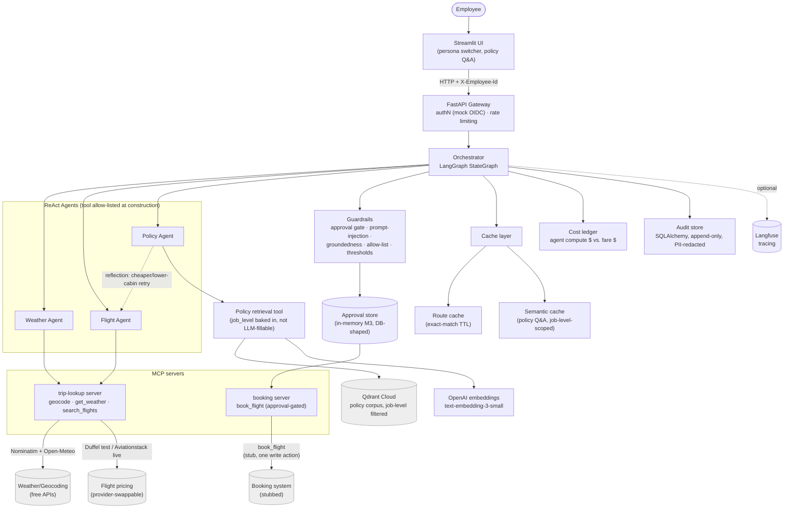
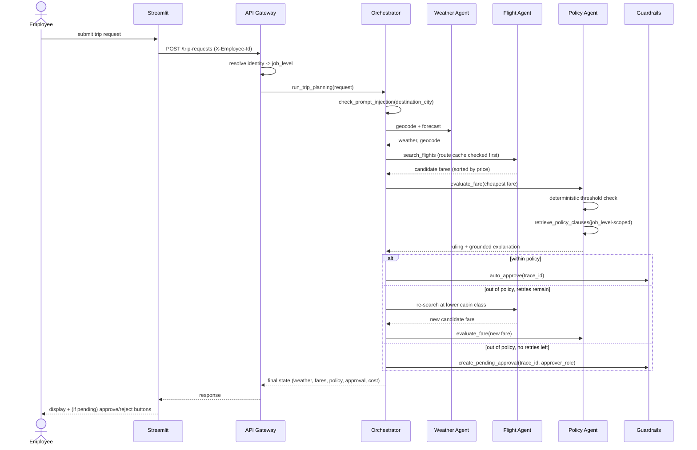

# Architecture

Corporate Travel Planner & Policy-Compliance Agent — a multi-agent ReAct
system built on LangGraph, with MCP as the tool-hosting boundary, Qdrant
for policy RAG, and a guardrail/audit/cost layer wrapped around all of it.

Full requirements: [`../enterprise_agent_build_spec.md`](../enterprise_agent_build_spec.md).
As-built deviations from that spec (vector DB, LLM/embeddings provider):
[`../CLAUDE.md`](../CLAUDE.md).

A polished version of the diagram below is also published as a standalone
page: **[Architecture Diagram (Artifact)](https://claude.ai/code/artifact/30854ccb-1e21-4348-aa35-cd1dae44832a)**
— private by default; this markdown version is the durable, in-repo source
of truth if that link's access changes.

---

## 1. System overview

An employee submits a trip request through Streamlit. The FastAPI gateway
authenticates them (mock persona header today; OIDC-shaped interface for
later) and hands the request to a LangGraph orchestrator, which runs three
ReAct agents in sequence — Weather, Flight, Policy — with a reflection edge
back from Policy to Flight when a fare is out of policy. Every step is
wrapped in guardrails, logged to an append-only audit store, costed on a
dual ledger, and (optionally) traced in Langfuse. The one mutating action
in the system — booking — is a separate, higher-scrutiny MCP server gated
by an approval record.

## 2. Request lifecycle (sequence)

## 3. Component responsibilities

| Component | Responsibility | Source |
|---|---|---|
| API Gateway | AuthN (mock OIDC persona), rate limiting, request/response shape | `src/trip_planner/api/main.py`, `auth.py` |
| Orchestrator | LangGraph state machine: dependency order + reflection loop | `src/trip_planner/orchestrator/graph.py` |
| Weather / Flight Agent | Tool-scoped ReAct agents, MCP-backed tools | `src/trip_planner/agents/weather_agent.py`, `flight_agent.py` |
| Policy Agent | Deterministic ruling + grounded LLM explanation, RAG-backed | `src/trip_planner/agents/policy_agent.py` |
| MCP servers | Tool-hosting boundary: trip-lookup (read) vs. booking (the one write action) | `src/trip_planner/mcp_servers/` |
| RAG | Job-level-scoped Qdrant retrieval over the policy corpus | `src/trip_planner/rag/` |
| Guardrails | Allow-list, prompt-injection, groundedness, thresholds, approval gate | `src/trip_planner/guardrails/` |
| Cache | Route cache (exact-match) + semantic cache (policy Q&A) | `src/trip_planner/cache/` |
| Cost ledger | Dual ledger: agent compute $ vs. business fare $ | `src/trip_planner/cost/ledger.py` |
| Audit store | Append-only, PII-redacted, queryable by trace_id | `src/trip_planner/audit/` |
| Observability | Langfuse tracing (no-op without credentials) | `src/trip_planner/observability/` |

See [`HLD.md`](HLD.md) for design rationale and [`LLD.md`](LLD.md) for data
contracts and module-level detail.
